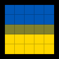
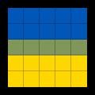

# SkiaMorph: A High-Quality Analytic Supersampling SVG Renderer

SkiaMorph (from Ancient Greek _σκιά_ “shadow” and _μορφή_ “shape”; also an alternative form of _skeuomorph_) is a high-quality analytic supersampling SVG renderer based on [Skia](https://github.com/google/skia).

## 🤔 Why?

Most SVG rasterizers use coverage-based anti-aliasing per element: the opacity of a pixel represents how much of that pixel is covered by the element.  
This works well in many cases, but it breaks down when two shapes meet exactly at a non-pixel-aligned edge, as in the example below:

<table>
  <tr>
    <th style="width: 33%">Exact SVG</th>
    <th style="width: 33%">Conventional anti-aliasing</th>
    <th style="width: 33%">Analytic, even supersampling</th>
  </tr>
  <tr>
    <td align="center">
      
    </td>
    <td align="center">
      
    </td>
    <td align="center">
      
    </td>
  </tr>
</table>

In the left SVG (visualized with a black background), we render a 5×5 grid of pixels (indicated by the partially transparent black grid), with a blue rectangle in the upper half and a yellow rectangle in the lower half (a square version of the Ukrainian flag).
The five pixels in the middle row are half blue and half yellow, i.e. each rectangle has 50% coverage in those pixels.

With conventional coverage-based anti-aliasing, these shapes are rasterized independently for performance reasons.
The yellow rectangle (drawn later) contributes 50% of the final colour, and the remaining 50% is split evenly between blue and the background (black), as seen in the middle column.
Per-pixel coverage cannot distinguish _where_ within the pixel a shape lies, or which regions overlap: two shapes with 50% coverage each might not overlap at all (as here), might overlap completely, or anything in between.
As a result, background colour “leaks” into pixels that should be fully covered.

This is typically referred to as a _hairline artefact_ and is a fundamental limitation of this anti-aliasing model.

SkiaMorph takes a different, analytic approach: each pixel is subdivided into a regular grid of subpixels whose centre points are used as sample locations.

For each sample point:

1. All SVG elements are traversed in front-to-back order, with spatial acceleration to reduce the number of elements to test.
2. For each element that contains the sample point, its colour and opacity are evaluated and composited with any previously hit, partially transparent elements.
3. Once the accumulated opacity is fully (or nearly) opaque, the search stops for that sample; otherwise it continues with the next element.

Finally, all subpixel samples for a pixel are averaged to produce the correctly anti-aliased colour, as shown in the right column.

> [!IMPORTANT]
> This approach is conceptually very similar to ray tracing: with enough samples per pixel, it is extremely high quality, but also comparatively slow.  
> SkiaMorph implements several optimizations (e.g. tiling/acceleration structures) to reduce the cost, but it is still substantially more expensive than traditional SVG rasterization, especially at high sample counts.  
> In return, you get a practical approach that is robustly free of hairline artefacts.

## 🛠️ How?

The core pipeline looks like this:

- **SVG and CSS parsing**:  
  Skia’s SVG module is used to parse the SVG structure itself (elements, attributes, transforms), but it does not parse `<style>` elements.  
  CSS styles are parsed via the [ANTLR4 CSS3 grammar](https://github.com/antlr/grammars-v4/tree/master/css3) and then matched/interpreted by a small custom implementation.

- **Preprocessing and scene flattening**:  
  In a first pass, two maps are collected:
  - an `id` → element map (for resolving `<use>` references),
  - a map of `<clipPath>` elements (for resolving `clip-path` attributes).

  In a second pass, all `<path>` and `<image>` elements are gathered with:
  - their geometry in root coordinates,
  - bounding boxes,
  - resolved colour and opacity for `<path>`,
  - decoded image data and sampling transforms for `<image>`,

  while taking transformations, clip masks, and `<use>` references into account.  
  The result is a compact, back-to-front list of drawable nodes.

- **Tiling / acceleration structures**  
  The `viewBox` is divided into a fixed grid of tiles.
  Each node is registered in all tiles intersecting its bounding box.
  During sampling, only the nodes in the corresponding tile are tested, dramatically reducing the number of containment tests per sample.

- **Parallel analytic supersampling**:  
  This flattened stack of elements is then sampled at subpixel positions (as described above).
  Each sample is evaluated independently and in parallel using OpenMP, producing the final supersampled RGBA output.

## ✅ What Is (Not) Supported?

Currently, SkiaMorph supports the following SVG features and has the following limitations:

- **Elements**
  - Supported: `<svg>`, `<defs>`, `<g>` for grouping, `<clipPath>` for clipping, `<path>` and `<image>` for drawing, and `<use>` for referencing by `id`.
  - Not yet supported: other shape primitives such as `<circle>`, `<rect>`, `<line>`, `<polygon>`, etc.  
    These need to be represented as `<path>` elements to be rendered.

- **Paths**
  - Only solid `fill` is supported.
  - `stroke` and related attributes are currently ignored, though basic stroking is very likely to be the next feature added.

- **Images**
  - Only inline images (`data:…` URLs) using PNG or WEBP are supported at the moment (additional formats may be added later).
  - Nearest-neighbour sampling is used for all image sampling; there is currently no filtering beyond that.

- **CSS / styles**
  - `<style>` elements are supported if each rule uses a **single, class-only selector** (e.g. `.foo { … }`).
  - More complex selectors (combinators, IDs, attributes, pseudo-classes, etc.) are currently not supported and may be added in the future.

## 📦 Building

SkiaMorph uses the Meson build system and requires a C++23-capable compiler (GCC 17 and Clang 22 have been tested on Linux).
Skia is brought in as a Meson subproject and is automatically downloaded and built with a small patch set.

Beyond Skia, SkiaMorph depends on:

- [ANTLR4 C++ runtime](https://github.com/antlr/antlr4/tree/dev/runtime/Cpp)
- [{fmt}](https://fmt.dev/)

Skia itself is configured using [GN](https://gn.googlesource.com/gn) and built with Ninja, so both must be installed.
In its current configuration, Skia additionally requires the following system libraries (see Skia’s build instructions for details):

- Expat
- FreeType
- HarfBuzz
- ICU
- libjpeg
- libpng
- libwebp
- zlib

A simple build workflow looks like this:

```bash
meson setup --buildtype release build
meson compile -C build
# Render input.svg to output.png at 1024×1024 with 4×4 samples per pixel
./build/SkiaMorph input.svg 1024 1024 output.png 4 4
```

## 📜 Licences

SkiaMorph is licensed under the terms of the Mozilla Public Licence 2.0, provided in [`License`](License).

The ANTLR4 CSS3 grammar in [`src/antlr-css3`](src/antlr-css3) is taken verbatim from the [`antlr/grammars-v4`](https://github.com/antlr/grammars-v4) repository and is licensed under the MIT licence, provided in [`src/antlr-css3/LICENSE.md`](src/antlr-css3/LICENSE.md).

The files [`src/svg-dom.hpp`](src/svg-dom.hpp) and [`src/svg-dom.cpp`](src/svg-dom.cpp) are closely based on Skia’s [`modules/svg/include/SkSVGDOM.h`](https://github.com/google/skia/blob/chrome/m147/modules/svg/include/SkSVGDOM.h) and [`modules/svg/src/SkSVGDOM.cpp`](https://github.com/google/skia/blob/chrome/m147/modules/svg/src/SkSVGDOM.cpp), which are licensed under the BSD 3-clause licence, provided in [`LicenseSkia`](LicenseSkia).
